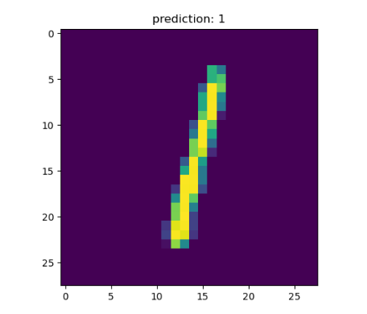
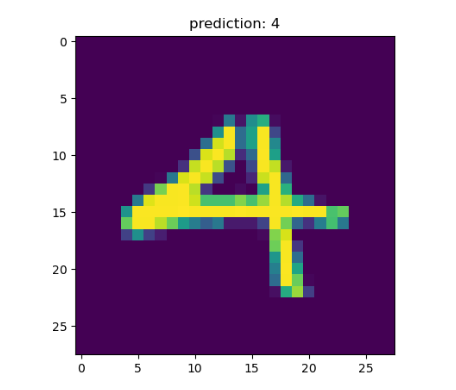
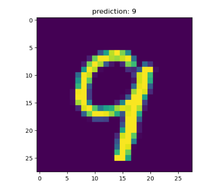
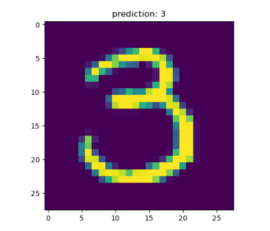
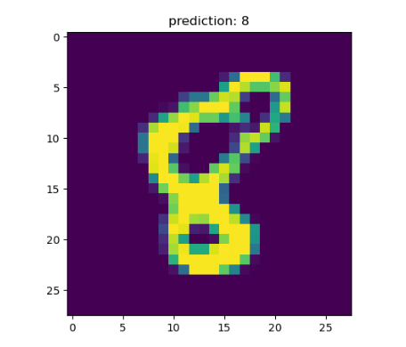

# MNIST-Test
在M1版macOS上基于Pytorch编写的手写识别网络

## 拉取源代码
```shell
git clone https://github.com/ExMikuPro/MNIST-Test.git
```

## 签出New分支
```shell
git checkout New --
```

## 创建虚拟环境
确保实验里安装并配置了Anaconda 23.7.4及以上版本！
执行一下命令进行环境再现:
```shell
conda env create -f environment.yaml
activate MNIST-Test 
```

## 运行推理程序
```shell
python3 main.py
```

## 输出结果







main.py:训练模型
~~model.py:使用模型进行数字识别~~


~~目前啊还不是很准确:(~~
New分支里模型的识别率已基本稳定，识别精度达到了0.9628

有待进一步优化@_@
